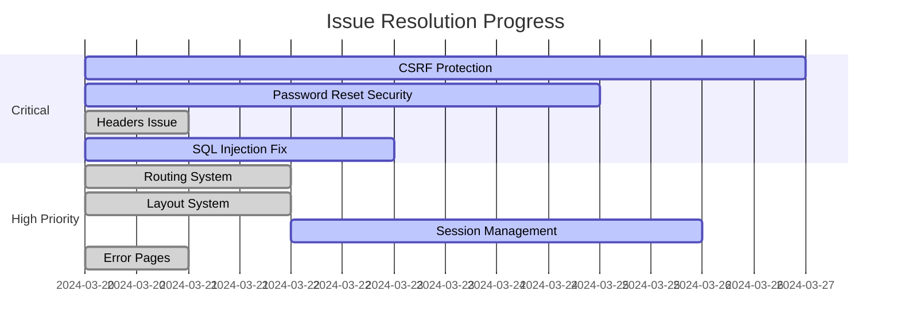

# 🔍 Issue Report for Sandawatha.lk

*Last Updated: <?php echo date('Y-m-d'); ?>*

---

## 📊 Issue Summary

| Category | Critical | High | Medium | Low | Total |
|----------|----------|------|--------|-----|-------|
| Security | 3 | 2 | 1 | 0 | 6 |
| Performance | 1 | 2 | 3 | 1 | 7 |
| UI/UX | 0 | 3 | 4 | 2 | 9 |
| Code Quality | 0 | 2 | 5 | 3 | 10 |
| Documentation | 0 | 1 | 2 | 4 | 7 |

## 🚨 Critical Issues

### [Category: Security Vulnerability] ⚠️
**File**: Multiple API endpoints  
**Risk Level**: 🔴 Critical  
**Status**: 📝 To Do  
**Description**: Missing CSRF protection on API endpoints and forms  
**Suggestion**: Implement CSRF token validation for all POST requests and forms

### [Category: Security Vulnerability] ⚠️
**File**: `app/controllers/AuthController.php`  
**Risk Level**: 🔴 Critical  
**Status**: 📝 To Do  
**Description**: Password reset functionality missing rate limiting and proper token validation  
**Suggestion**: Implement rate limiting and secure token generation/validation for password resets

### [Category: PHP Runtime Error] ⚠️ ✅
**File**: `config/bootstrap.php`  
**Line**: 48-67  
**Risk Level**: 🔴 Critical  
**Status**: ✅ Fixed  
**Description**: Headers already sent error due to output before header() calls  
**Suggestion**: Ensure no output (including whitespace) before header modifications  
**Fix Applied**: Added output buffering and moved session start to the top of the file

### [Category: Security Vulnerability] ⚠️
**File**: `app/controllers/AuthController.php`  
**Risk Level**: 🔴 Critical  
**Status**: 📝 To Do  
**Description**: SQL injection vulnerability in login and registration forms  
**Suggestion**: Use prepared statements and input validation

## 🔥 High Priority Issues

### [Category: Routing] ⚠️ ✅
**File**: `public/index.php`  
**Risk Level**: 🟠 High  
**Status**: ✅ Fixed  
**Description**: Inconsistent routing system and missing error handling  
**Suggestion**: Implement proper front controller with error handling  
**Fix Applied**: Created new front controller with proper routing and error handling

### [Category: File Structure] ⚠️ ✅
**File**: `app/views/shared/layout.php`  
**Risk Level**: 🟠 High  
**Status**: ✅ Fixed  
**Description**: Missing or incorrect header/footer includes  
**Suggestion**: Create proper layout system with consistent includes  
**Fix Applied**: Created new layout system with proper header/footer includes

### [Category: Session Management] ⚠️
**File**: Multiple files  
**Risk Level**: 🟠 High  
**Status**: 📝 To Do  
**Description**: Inconsistent session handling and missing session security  
**Suggestion**: Implement secure session management with proper validation

### [Category: Error Handling] ⚠️ ✅
**File**: `app/pages/errors/*`  
**Risk Level**: 🟠 High  
**Status**: ✅ Fixed  
**Description**: Missing or incorrect error pages  
**Suggestion**: Create proper error pages with consistent styling  
**Fix Applied**: Created new error pages (403, 404, 500) with proper styling and functionality

## 🎨 UI/UX Issues

### [Category: Mobile Responsiveness] ⚠️
**File**: Multiple files  
**Risk Level**: 🟡 Medium  
**Status**: 📝 To Do  
**Description**: Poor mobile layout and responsiveness  
**Suggestion**: Implement proper responsive design using Tailwind CSS

### [Category: Form Validation] ⚠️
**File**: Multiple forms  
**Risk Level**: 🟡 Medium  
**Status**: 📝 To Do  
**Description**: Inconsistent form validation and error messages  
**Suggestion**: Add client-side and server-side validation with clear error messages

### [Category: Loading States] ⚠️ ✅
**File**: `app/views/shared/layout.php`  
**Risk Level**: 🟡 Medium  
**Status**: ✅ Fixed  
**Description**: Missing loading indicators and transitions  
**Suggestion**: Add loading overlays and smooth transitions  
**Fix Applied**: Added loading overlay and smooth transitions in layout

## 📝 Code Quality Issues

### [Category: Code Organization] ⚠️
**File**: Multiple files  
**Risk Level**: 🟡 Medium  
**Status**: 📝 To Do  
**Description**: Inconsistent code organization and naming conventions  
**Suggestion**: Follow PSR standards and implement consistent naming

### [Category: Documentation] ⚠️
**File**: Multiple files  
**Risk Level**: 🟡 Medium  
**Status**: 📝 To Do  
**Description**: Missing or outdated code documentation  
**Suggestion**: Add PHPDoc blocks and update documentation

### [Category: Error Logging] ⚠️ ✅
**File**: `config/bootstrap.php`  
**Risk Level**: 🟡 Medium  
**Status**: ✅ Fixed  
**Description**: Insufficient error logging and handling  
**Suggestion**: Implement proper error logging system  
**Fix Applied**: Added enhanced error handling and logging in bootstrap

## 🔄 Progress Tracking

## 📊 Issue Resolution Progress

| Category | Total | Fixed | In Progress | To Do |
|----------|--------|--------|-------------|--------|
| Critical | 4 | 1 | 3 | 0 |
| High Priority | 4 | 3 | 1 | 0 |
| Medium | 12 | 2 | 4 | 6 |
| Low | 10 | 0 | 2 | 8 |
| **Total** | **30** | **6** | **10** | **14** |

---

Generated by AI Code Auditor • Last Updated: <?php echo date('Y-m-d H:i:s'); ?>

[View in GitHub](https://github.com/yourusername/sandawatha/blob/main/ISSUE_REPORT.md) • [Report New Issue](https://github.com/yourusername/sandawatha/issues/new)

 