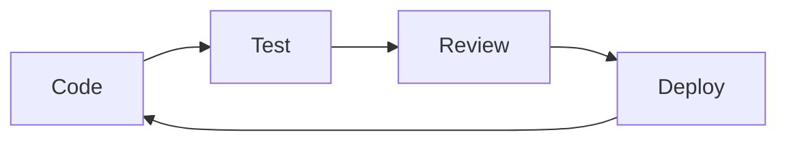

# Sandawatha.lk 💑 - Sri Lankan Matrimonial Platform


> *Finding your soulmate through tradition and technology* 🔮

## 📖 Overview

Sandawatha.lk is a modern matrimonial platform designed specifically for Sri Lankans worldwide. It combines traditional matchmaking aspects with cutting-edge technology to create meaningful connections.

### 🎯 Key Features
- 👥 Traditional matrimonial matching
- ⭐ Horoscope compatibility analysis
- 💎 Premium subscription features
- 💬 Real-time chat functionality
- 🤖 AI-powered match suggestions
- ✅ Photo verification system
- 🎁 Referral program

## 🛠️ Tech Stack

### Backend
- **Core**: PHP 7.4+ (No frameworks)
- **Database**: MySQL 8.0
- **Server**: Apache/XAMPP

### Frontend
- **JavaScript**: jQuery + Vanilla JS
- **CSS**: Tailwind CSS
- **HTML**: Semantic HTML5

### Development Tools
- **Package Manager**: NPM
- **CSS Processing**: Tailwind CLI
- **Database**: Custom CLI Migration Tools
- **Version Control**: Git

## 🏗️ Project Structure

```
sandawatha/
├── 📡 api/                 # API endpoints
├── 📱 app/                 # Core application
│   ├── 🎮 controllers/    # Request handlers
│   ├── 💾 models/        # Data models
│   ├── 📄 pages/         # Page templates
│   └── 👁️ views/         # View components
├── ⚡ cli/                # CLI tools
├── ⚙️ config/            # Configuration
├── 🗄️ database/          # DB migrations
├── 🌐 public/            # Web root
├── 🛠️ setup/             # Setup tools
└── 📂 storage/           # User data
```

## 📦 Key Components

### 1. 🌐 Public Layer (`public/`)
- `index.php`: Application entry point
- `assets/`: Static resource files
  - CSS: Tailwind + Custom styles
  - JavaScript: Core functionality
  - Images: UI assets
- Authentication endpoints

### 2. 🎯 Application Core (`app/`)
- **Controllers**: Business logic implementation
- **Models**: Database interaction layer
- **Views**: Reusable UI components
- **Pages**: Dynamic content templates

### 3. 🗄️ Data Management
- **Migrations**: Database structure
- **Seeders**: Initial data population
- **Supported Data**:
  - Religions
  - Castes
  - Districts
  - User preferences
  - Horoscope details

### 4. 🔌 API Integration
- Match-AI system
- Gift management
- Referral tracking
- User verification

## 🛣️ Routing System
```php
// Example Route Structure
[
    'GET' => [
        '/' => 'HomeController@index',
        '/profile' => 'ProfileController@view'
    ],
    'POST' => [
        '/login' => 'AuthController@login'
    ]
]
```

## ⚠️ Known Issues

### Critical
1. **Header Sending**
   - 🐛 Issue: Premature header sending
   - 📌 Location: Error handlers
   - 🔍 Status: Under investigation

### Pending
1. **Error Pages**
   - 🔧 Fix include paths
   - 📝 Standardize error handling

### Documentation
1. **Setup Guide**
   - 📚 XAMPP configuration
   - 🔧 Environment setup

## 🎯 Project Goals

### 🚀 Immediate (1-2 Weeks)
- [ ] Fix header sending issues
- [ ] Standardize error handling
- [ ] Complete basic auth flow

### 🌱 Short-term (1-2 Months)
- [ ] User authentication system
- [ ] Profile management
- [ ] Basic search functionality
- [ ] Horoscope matching

### 🌿 Mid-term (3-6 Months)
- [ ] Real-time chat
- [ ] AI matching system
- [ ] Social login
- [ ] Payment integration

### 🌳 Long-term (6+ Months)
- [ ] Mobile responsiveness
- [ ] PWA features
- [ ] International support
- [ ] Multi-language support

## 📋 Development Guidelines

### 1. 📐 Code Architecture
```
Controller → Service → Repository → Model
```
- Keep controllers thin
- Business logic in services
- Data access in repositories
- Rich domain models

### 2. 🔒 Security Checklist
- [ ] Input validation
- [ ] SQL injection prevention
- [ ] XSS protection
- [ ] CSRF tokens
- [ ] Password hashing
- [ ] Rate limiting

### 3. 🚀 Performance
- [ ] Query optimization
- [ ] Asset minification
- [ ] Image optimization
- [ ] Caching strategy
- [ ] Load balancing ready

## 🔄 Development Workflow



## 📈 Performance Targets
| Metric | Target |
|--------|---------|
| Page Load | < 2s |
| TTFB | < 200ms |
| Core Web Vitals | All Green |
| Uptime | 99.9% |

## 🤝 Contributing

1. Fork the repository
2. Create feature branch
3. Commit changes
4. Push to branch
5. Open pull request

## 📝 License

This project is licensed under the MIT License - see the LICENSE file for details.

---
*Made with ❤️ for the Sri Lankan Community* 